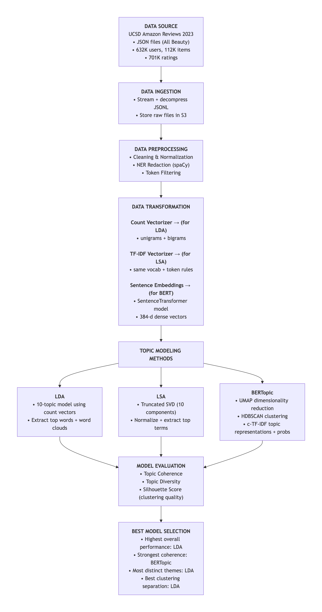

## I. Introduction 

Topic modeling is one of the most widely used techniques in the industry today, from technology to health and marketing; it provides powerful tools that assist in organizing and understanding themes in large unstructured text data. This type of modeling automatically discovers meaningful subjects within documents, and enables businesses to better understand conversational structures, uncover common themes, and gain insights into human behavior. Although topic modeling is the most popular approach to understanding human behavior, there are fundamental differences in the multiple methods of topic modeling, which range from probabilistic and dimensional reduction techniques, embedding-based methods, indicating that there is no single solution that is a one-size-fits-all. 

This project explores a comparative analysis of three of the main topic modeling methods today: Latent Dirichlet Allocation (LDA), Latent Semantic Analysis (LSA), and a BERT-based transformer model (BERTopic). This comparison is critical because all of these models use fundamentally different methodologies for processing text and uncovering the themes in it.  The main objective is to evaluate and compare how well these models perform in discovering meaningful topics from an Amazon Reviews dataset. The performance metrics that will be used to measure success are: Topic coherence, Topic diversity, and Clustering performance through Silhouette score. These performance metrics will assess the models’ ability to capture how meaningful and interpretable each topic is and whether top words within a topic have a logically connected theme. Additionally, they measure how distinct the topics are from one another and if a wide range of themes is captured, rather than redundant and overlapping topics. Finally, the metrics will evaluate how well a model groups similar reviews together and validate that topics reflect real structure in customer feedback.

---

# II. Literature Review 

Classic topic modeling, like LDA, represent documents through a "bag-of-words" approach. This framework models each document as a finite mix over latent topics, and then each topic is later on extracted and defined by a distribution over words (1). Although LDA is a foundational model, it is limited because, it disregards semantic relationships and the natural sequential order of words. This classic probabilistic approach will be the baseline model in our project.

​
Attempts were made to bridge LDA’s gap between the order of words and the semantic relationship by introducing methods such as LSA. Where LDA would fall short because of its unreliability of simple keyword matching, LSA uses matrix decomposition to discover the latent structure that was disregarded by LDA in the term-document relationships (2). The LSA model does this by using the Singular Value Decomposition (SVD) method. This matrix decomposition method is used on a term-document matrix that is usually derived from TF-IDF counts, it then  uncovers the underlying latent semantic structure in a reduced-dimensional space (2). LSA’s ability to overcome issues such as synonymy, many ways to express a concept, and polysemy, words having multiple meanings, highlights why classical models may not be suited to interpret diverse and nuanced corpuses.

Presently, there are modern contextual topic modeling approaches, such as BERTopic, this model addresses the challenges that were faced by LDA and LSA by completely moving away from the  word-frequency statistics method to instead using rich document embeddings based representations [@grootendorst2022bertopic] (3). The BERTopic model is able to achieve this by using other pretrained language models like the baseline the Sentence-BERT. The language based transformer converts documents into rich dense embeddings. These embeddings from Sentence-Bert are then later used to uncover semantics, this is done through the encoding of semantic meaning. Additionally, BERTopic tops LDA and LSA, because it is able to use the encodings and generate natural clusters where, similar general ideas/themes are pulled together. These idea clusters (topics) are created in a reduced vector space, that is made by UMAP dimensionality reduction, and the clusters are formed through HDBSCAN. To incorporate semantic meaning and topic interpratation, the model uses a class based procedure ( c-TF-IDF) that interprets topic descriptions as well as balances semantics with interpretability [@grootendorst2022bertopic] (3). 

Therefore, through this literature review, we can see that contextual approaches capture more coherent topics; however, they do this by relying on baseline models and offer hybrid structures that differ from single source models. The difference in the  methodologies of these models make direct comparison critical. Classic models offer simplicity and efficiency, whereas modern contextual models provide stronger semantic modeling in return; however, they may come at a computational cost. This is why conducting a side by side evaluation is meaningful, so we can obtain a deeper understanding of how each of the models’ approach affect topic quality, coherence, and practical usefulness.

---

## III. Methods 

This study was run on an EC2 instance and used an S3 bucket as storage so that the analysis could be automated. Each step retrieved the resulting files from the previous step and dumped the new resulting files into a subfolder of the S3 bucket. That well-aligned data pipeline ensured that the analysis can be reproduced seamlessly without the limitation of local storage. 

#### A. Data Collection 

The first step of the pipeline was data collection as the JSON files were scraped  from the University of California San Diego Amazon Reviews 2023 website [@amazonreviews2023] (UCSD Amazon Reviews 2023, 2023). The university’s source index page contained multiple JSON.gz files separated by product category such as all_beauty, disks, movies_and_tv etc. All files were later dumped into the S3 bucket subfolder, amazon_raw/S3 so that the files were not stored locally as each file contained more than 1 million records thus were incredibly large. 

#### B. Data Preprocessing 

The second step of the pipeline was data  preprocessing and consisted of the following three steps. By preprocessing the data, noise and bias were eliminated and the reliability of the models’ outputs was ensured.  

##### 1. Data Cleaning

Each JSON file was read from the amazon_raw/ S3 subfolder and their reviewText, summary, and title fields were lowercased, scrubbed of URLs, usernames, non-ASCII characters, punctuation, and extra whitespace. Due to computational constraints, only the all_beauty json file was successfully cleaned. By removing these characters from the text, the models were able to focus on useful as opposed to human level text markers.

##### 2. Named Entity Recognition Redaction

NER, which is the NLP process of recognizing known entities from text and replacing them with tags, was then conducted. The model used for this process is  spaCy’s en_core_web_sm model. For example, detected people, organizations, locations, and other entity types were replaced with tags like [PERSON], [ORG], and [LOCATION]. By doing so, NER prevents the model from creating topics around specific entities. The clean file was written to a temporary file and then uploaded to the amazon_clean/S3 subfolder. 

#### 3. Text Preprocessing
Further text preprocessing was conducted in the AmazonPreprocessor class, which was the vectorization class, because more noise appeared when the topics were being generated. The noise elimination included scikit-learn’s token pattern of length less than three, HTML tags such as “br” and “nbsp” and stopwords. The removed stopwords included scikit-learn’s English list and NLTK stopwords. As the analysis was on Amazon reviews, certain words such  “great” and “product” were expected from the data. They were therefore removed to assure that meaningful signals were captured from the topics.

#### C. Data Transformation

The third step of the pipeline was the generation of three types of vectors, count vectors, TF-IDF vectors and sentence embeddings. By transforming the text into these vectors, the comparison of models that rely on the three vector types was possible. The vectorization steps were conducted with a class AmazonPreprocessor that read the clean files from amazon, applied the additional aforementioned preprocessing, and vectorized using three class methods that each performed a type vectorization. After data transformation, the resulting files were stored in the amazon_vectors/S3 subfolder containing the three vectors’ subfolders. 

##### 1. Count vectorization

Count vectorization was conducted using the class build_count_vectors method, which collected the clean files from S3 and fitted a scikit-learn CountVectorizer model to the text. The parameters of the model included the consideration of both unigrams and bigrams, a maximum of 40,000 features, and a frequency filter of (min_df=20, max_df=0.5). By applying these parameters, signal words and two word phrases were considered in the count. The model’s features did not exceed an exorbitant number of features. Only words of moderate frequency were considered as overly frequent and overly rare words were not considered from the corpus. As a result, sparse documents–term matrix and vocabulary mapping were added to the amazon_vectors/countvectorizer/S3 subfolder as vectors.npz and vocab.json.

##### 2. Term Frequency–Inverse Document Frequency Vectorization

Term Frequency-Inverse Document Frequency vectorization was conducted using the build_tfidf_vectors class method which used the same document stream, token pattern, stopwords, ngram_range, and frequency thresholds as the count vectorization model. This step produced a sparse matrix of TF–IDF weights instead of raw counts. As a result, count vectors, the matrix and the vocabulary were then uploaded to S3 under amazon_vectors/tfidf/ for later modeling.

##### 3. Sentence embeddings

Dense sentence embeddings were created using the build_embeddings method by loading the  SentenceTransformer all-MiniLM-L6-v2. The model encoded the clean text in batches of 64 into a fixed-size NumPy array of embeddings. The array was saved as embeddings.npy and uploaded to amazon_vectors/embeddings/S3 subfolder. 

####  D. Exploratory Data Analysis

  <iframe src="./data/eda_results/plotly_rating_dist.html" width="800" height="500"></iframe>
   <figcaption>Figure 1: Frequency Distribution of Customer Ratings Across Beauty Amazon Reviews</figcaption>

  <iframe src="./data/eda_results/plotly_text_dist.html" width="800" height="500"></iframe>
   <figcaption>Figure 2: Frequency Distribution of Word Counts Across Beauty Amazon Reviews</figcaption>

  <iframe src="./data/eda_results/plotly_verified_purchase.html" width="800" height="500"></iframe>
   <figcaption>Figure 3: Distribution of Star Ratings for Verified vs. Non-Verified Purchases</figcaption>

  <iframe src="./data/eda_results/interactive_reviews_ratings_2023.html" width="800" height="500"></iframe>
   <figcaption>Figure 4: Monthly Trends in Beauty Amazon Reviews and Average Ratings </figcaption>

#### E. Modeling 

The fifth step in the pipeline was the training of the three selected topic models, Latent Dirichlet Allocation, Latent Semantic Analysis, and Bidirectional Encoder Representations from Transformers. The three models used the three types of vectors as input and provided insights on how these models would perform. Each model outputted 10 topics. Graphs were also generated to better understand the result . The outputs of each model were saved in the data/ local folder 

##### 1. Latent Dirichlet Allocation
A Latent Dirichlet Allocation (LDA) model from scikit-learn was fitted to the previously saved All Beauty Amazon reviews count vectors to generate 10 topics. As the literature has established LDA treats each document as a mix of topics, and each topic as a group of words that often appear together [@blei2003lda] (Blei, Ng, and Jordan, 2003). 

The model’s parameters consisted of batch processing with a random seed for consistency. The 10 topics were considered by the words that received the highest weights. The resulting files were a text file of the generated topics, the trained model and a JSON file of the corpus’ vocabulary. In sum, the directory included count_vectors.npz, vocab.json, lda_topics.txt, and a wordclouds folder. Each set of words were later interpreted as short phrases so that they can be easily understood. Word clouds were generated to better understand the weight of each word in a topic as the words with the highest weights appear bigger than the others. All outputs were saved locally under the data/lda_results folder. These outputs would later be evaluated to determine the LDA model’s performance as compared to the other two models.

##### 2. Latent Semantic Analysis 

Latent Semantic Analysis (LSA), identified lower-dimensional topics in the All Beauty Amazon reviews. LSA applied Truncated SVD to the TFIDF matrix, which reduced sparse text features to dense semantic components (Deerwester et al, 1990). The workflow downloaded the TFIDF vectors and vocabulary from S3 and loaded the sparse matrix locally to keep the feature space aligned with the preprocessing step.

The model used ten topics using scikit learn TruncatedSVD with a fixed random seed. The pipeline applied a Normalizer after SVD to produce stable document embeddings. After training, the code extracted the highest weight terms for each component from the SVD loadings. These terms highlighted the words that define each LSA dimension.

##### 3. Bidirectional Encoder Representations from Transformers BERTopic 

---

## IV Results 

### A. Latent Dirichlet Analysis 

The 10 topics generated by the LDA model were consistent with the beauty product theme of the dataset. As the top weighted words were considered as the topics, each set of words can be easily characterized as a beauty product category. For example, as seen in the LDA topics table below, the first topic included words such as “hair”, “iron”, “heat” , which can easily be interpreted as heat styling tools. The second topic included words such as “brush”, “quality”, “bristle", which can be interpreted as brush set quality. Overall, the topics reflected a very specific category of the beauty theme as some topic were about eye products and the other was about foot products.

  <iframe src="./data/lda_results/ldatable.png" width="800" height="500"></iframe>
   <figcaption>Figure 5: LDA Topic terms and themes for All Beauty reviews</figcaption>

When considering Topic 0 wordcloud more closely, it was obvious that “hair”, “iron” “clips” and “flat” were the largest in size in that wordcloud; they were the highest weighted terms in that topic. For that reason, it was easily determined that this particular topic could be interpreted as hair heating tools. 

  <iframe src="./data/lda_results/wordclouds/topic_0.png" width="800" height="500"></iframe>
   <figcaption>Figure 6: LDA topic 0 wordcloud </figcaption>

### B. Latent Semantic Analysis

The 10 generated topics from the LSA model were also consistent with the beauty product theme of the dataset. These words were considered the highest signals of the TF-IDF space. However, although the topics were interpreted as phrases, the separation of the beauty categories of the topics were not as distinct as the LDA. For example, the first topic included words such as “hair”, “skin” and “face”, which can place this category in all three categories. The second topic was more consistent with a curly hair care topic. The third topic included words such as “hair”, “skin” and “face”, which can again describe the three categories for beauty products. 

  <iframe src="./data/lsa_results/lsatable.png" width="800" height="500"></iframe>
   <figcaption>Figure 7: LDA Topic terms and themes for All Beauty reviews</figcaption>

Figure 6

The weight distribution of each topic was visualized in the following figure. Between a range of -1 and 1, the weight of each topic indicated how strongly a topic represented the documents that it was reflecting. For example, topic 0 had the highest median weight, which shows that it represented the broadest spread in the vocabulary as compared to the other topics. Some topics show a wider distribution as compared to others, which indicated that some topics were more specialized than others.

  <iframe src="./data/lsa_results/topicdistribution.png" width="800" height="500"></iframe>
   <figcaption>Figure 8: Distribution of LSA Topic Strengths Across All Documents</figcaption>

### C. BERTopic 

  <iframe src="./data/bert_results/visuals/vis_topics_overview.html"
          width="850"
          height="600"
          style="border:none;">
  </iframe>
   <figcaption>Figure 9: Intertopic Distances in BERTopic Model</figcaption>

## V. Model Performance & Comparison 

Topic Coherence: 

  - Assesses how meaningful & interpretable each topic is. 
  - Ensures that the top words within a topic have a logically connected theme.
  
Topic Diversity: 

  - Measures how distinct the topics are from one another.
  - Ensures that a model captures a wide range of themes instead of redundant or overlapping topics.

Silhouette Score  (Clustering Performance): 

- Evaluates how well the model groups similar reviews together,
- Validates that topics reflect real structure in customer feedback.

#### A. Topic Model Evaluation Comparison

| Model     | Topic Coherence (c_v) | Topic Diversity | Silhouette Score (Cluster Performance) |
|-----------|------------------------|-----------------|----------------------------------------|
| **LDA**        | 0.3000                 | **0.83**           | **0.4563**                               |
| **LSA**        | 0.3058                 | 0.47            | -0.0265                                 |
| **BERTopic**   | **0.4204**             | 0.6384         | 0.0502                                  |

Across all three BERTopic performs best on topic coherence. 

- Discovered themes that are generally more semantically meaningful and internally consistent 
- Aligns with expectations → relies on dense sentence embeddings instead of raw word counts.

On topic diversity, LDA comes out strongest →  a wider spread of unique top words across topics. 

- Better at separating themes distinctly, even if the topics themselves aren’t as coherent. 
- LSA struggled → overlapping, less interpretable topics.

For cluster performance, that was measured by silhouette score, LDA again performs the best. 
- BERTopic’s silhouette score was weak 
- LSA's poor score → clusters are weakly formed but directionally sensible.

**BERTopic**  was the strongest model for **interpretability** and semantic quality, while **LDA** is the strongest for **structural separation** and topic distinctiveness. LSA consistently underperforms across metrics.

#### WHAT TO MODEL TO USE.....

- If you want meaningful, human-like topic themes →  **BERTopic**.
- If you need sharply separated clusters → **LDA** is better.

Overall BERTopic did outperform the baseline models on topic coherence so texts such as reviews, the model would be better and capturing real semantic structure. 

---

## VI Conclusion 

The original expectation of this study was that BERT would outperform LDA and LSA given the use of sentence embeddings which captured semantic meaning across the corpus. However, the findings of the current study revealed that the comparison of the topic models’ performance was more layered than originally expected. BERTopic outperformed both models in terms of providing human-like topics; while LDA provided more distinctly separated topics and LSA had the lowest overall performance.
Therefore, deciding on which model would perform the best depended mostly on the objective of the topic modeling task as opposed to the model itself. If discovering distinctly separated topics was the main task, LDA would be the choice. If discovering semantically sound topics was the main task, BERT would be the choice. But, it was clear that LSA underperformed for this current study so it would not be a good choice to implement LSA as a way of topic selection. 

  
   <figcaption>Figure 10: Current Study's Full Pipeline </figcaption>

---

## VII Limitations 

The main limitation of this study was computation. The current study sought the use of an EC2 instance and S3 bucket; however, the size of the files remained an obstacle as the analysis progressed. With that as the main obstacle, choices were made throughout the study that reflected that roadblock such as focusing on one Amazon review category, decreasing the number of topics generated to 10, and only processing a subset of the reviews during modeling. As a result, the models could not be evaluated on their performance using more than one product category. The question remained would the models provide even better performance if the entire dataset was used for the current study. 

--- 

## VIII Future Works 

## References
